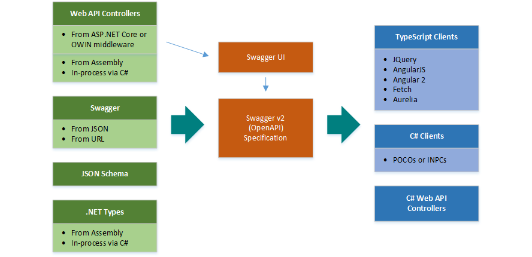
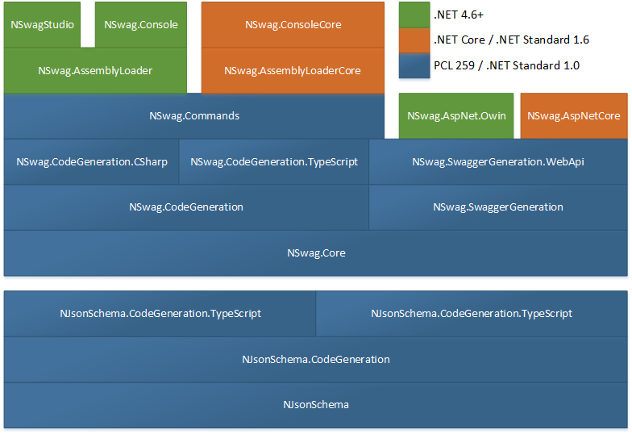

## NSwag: The Swagger/OpenAPI toolchain for .NET, ASP.NET Core and TypeScript

[](https://www.nuget.org/packages?q=NSwag)
[](https://www.npmjs.com/package/nswag)
[](https://ci.appveyor.com/project/rsuter/nswag-25x6o)
[](https://www.myget.org/feed/Packages/nswag)
[](https://gitter.im/NSwag/NSwag)
[](http://stackoverflow.com/questions/tagged/nswag)
[](https://github.com/RicoSuter/nswag/wiki)
[](#backers) 
[](#sponsors)

NSwag is a Swagger/OpenAPI 2.0 and 3.0 toolchain for .NET, .NET Core, Web API, ASP.NET Core, TypeScript (jQuery, AngularJS, Angular 2+, Aurelia, KnockoutJS and more) and other platforms, written in C#. The [OpenAPI/Swagger specification](https://github.com/OAI/OpenAPI-Specification) uses JSON and JSON Schema to describe a RESTful web API. The NSwag project provides tools to generate OpenAPI specifications from existing ASP.NET Web API controllers and client code from these OpenAPI specifications. 

The project combines the functionality of Swashbuckle (OpenAPI/Swagger generation) and AutoRest (client generation) in one toolchain. This way a lot of incompatibilites can be avoided and features which are not well described by the OpenAPI specification or JSON Schema are better supported (e.g. [inheritance](https://github.com/NJsonSchema/NJsonSchema/wiki/Inheritance), [enum](https://github.com/NJsonSchema/NJsonSchema/wiki/Enums) and reference handling). The NSwag project heavily uses [NJsonSchema for .NET](http://njsonschema.org) for JSON Schema handling and C#/TypeScript class/interface generation. 

 

The project is developed and maintained by [Rico Suter](http://rsuter.com) and other contributors.

**Features:**

- [Generate Swagger 2.0 and OpenAPI 3.0 specifications from C# ASP.NET (Core) controllers](https://github.com/RicoSuter/NSwag/wiki/Middlewares)
- Serve the specs via ASP.NET (Core) middleware, optionally with [Swagger UI](https://github.com/swagger-api/swagger-ui) or [ReDoc](https://github.com/Rebilly/ReDoc)
- Generate C# or TypeScript clients/proxies from these specs
- Everything can be automated via CLI (distributed via NuGet tool or build target; or NPM)
- CLI configured via JSON file or NSwagStudio Windows UI

**Ways to use the toolchain:** 

- Simple to use Windows GUI, [NSwagStudio](https://github.com/RicoSuter/NSwag/wiki/NSwagStudio)
- By using the [OpenAPI or OpenAPI UI OWIN and ASP.NET Core Middlewares](https://github.com/RicoSuter/NSwag/wiki/Middlewares) (also serves the [Swagger UI](https://github.com/swagger-api/swagger-ui)) (recommended)
- Via [command line](https://github.com/RicoSuter/NSwag/wiki/CommandLine) (Windows, Mac and Linux support through [Mono](http://www.mono-project.com/) or .NET Core console binary, also via [NPM package](https://www.npmjs.com/package/nswag))
- In your C# code, via [NuGet](https://www.nuget.org/packages?q=NSwag)
- In your [MSBuild targets](https://github.com/RicoSuter/NSwag/wiki/MSBuild)
- With [ServiceProjectReference](https://github.com/RicoSuter/NSwag/wiki/ServiceProjectReference) tags in your .csproj (preview)
- In your [Azure V2 Functions](https://github.com/Jusas/NSwag.AzureFunctionsV2) (external project, might not use latest NSwag version)

**Tutorials:**

- [Video Tutorial: How to integrate NSwag into your ASP.NET Core Web API project (5 mins)](https://www.youtube.com/watch?v=lF9ZZ8p2Ciw)
- [Integrate the NSwag toolchain into your ASP.NET Web API project](https://blog.rsuter.com/nswag-tutorial-integrate-the-nswag-toolchain-into-your-asp-net-web-api-project/)
- [Generate an Angular TypeScript client from an existing ASP.NET Web API web assembly](https://blog.rsuter.com/nswag-tutorial-generate-an-angular-2-typescript-client-from-an-existing-asp-net-web-api-web-assembly/)

**OpenAPI/Swagger Generators:**

- ASP.NET Web API assembly to OpenAPI (supports .NET Core)
    - [AspNetCoreOpenApiDocumentGenerator](https://github.com/RicoSuter/NSwag/wiki/AspNetCoreOpenApiDocumentGenerator)
    - [WebApiOpenApiDocumentGenerator](https://github.com/RicoSuter/NSwag/wiki/WebApiOpenApiDocumentGenerator)
        - Generates an OpenAPI specification for Web API controllers
    - [WebApiToOpenApiCommand](https://github.com/RicoSuter/NSwag/wiki/WebApiToOpenApiCommand)
        - Generates an OpenAPI specification for controllers in an external Web API assembly
        - [Also supports loading of .NET Core assemblies](https://github.com/RicoSuter/NSwag/wiki/Assembly-loading)
    - [TypesToOpenApiCommand](https://github.com/RicoSuter/NSwag/wiki/TypesToOpenApiCommand)
        - Generates an OpenAPI specification containing only types from .NET assemblies

**Code Generators:** 

- **CSharp Client**
	- [CSharpClientGenerator](https://github.com/RicoSuter/NSwag/wiki/CSharpClientGenerator)
		- Generates C# clients from an OpenAPI specification
		- Generates POCOs or classes implementing [INotifyPropertyChanged](https://msdn.microsoft.com/en-us/library/system.componentmodel.inotifypropertychanged(v=vs.110).aspx) supporting DTOs
		- The generated clients can be used with full .NET, .NET Core, Xamarin and .NET Standard 1.4 in general
- **CSharp Controllers** (contract first/schema first development)
	- [CSharpControllerGenerator](https://github.com/RicoSuter/NSwag/wiki/CSharpControllerGenerator)
	    - Generates Web API Controllers based on a OpenAPI specification (ASP.NET Web API and ASP.NET Core)
- **TypeScript Client**
	- [TypeScriptClientGenerator](https://github.com/RicoSuter/NSwag/wiki/TypeScriptClientGenerator)
		- Generates TypeScript clients from a OpenAPI specification
		- Available templates/supported libraries: 
			- JQuery with Callbacks, `JQueryCallbacks`
			- JQuery with promises `JQueryPromises`
			- AngularJS using $http, `AngularJS`
			- Angular (v2+) using the http service, `Angular`
			- window.fetch API and ES6 promises, `Fetch` (use this template in your React/Redux app)
			- Aurelia using the HttpClient from aurelia-fetch-client, `Aurelia` (based on the Fetch template)
			- `Axios` (preview)
	    
**Downloads**

- [Download latest **NSwagStudio MSI installer**](http://rsuter.com/Projects/NSwagStudio/installer.php) (Windows Desktop application)
- [Download latest **NSwag command line tools** and NSwagStudio as ZIP archive](http://rsuter.com/Projects/NSwagStudio/archive.php)
- [Download latest **CI Build Artifacts** from AppVeyor](https://ci.appveyor.com/project/rsuter/nswag/build/artifacts) (command line tools and NSwagStudio binaries)

**NPM Packages**

- [NSwag](https://www.npmjs.com/package/nswag): Command line tools (.NET and .NET Core) distributed as NPM package

**NuGet Packages**

Specification:

- **[NSwag.Core](https://www.nuget.org/packages/NSwag.Core/)** (.NET Standard 1.0 / 2.0 and .NET 4.5) [](https://apiverse.io/organizations/nuget-org/nuget-feeds/public/packages/NSwag.Core/versions/latest?tab=types&type=NSwag.OpenApiDocument)
    - The OpenAPI/Swagger reader and writer classes, see [OpenApiDocument](https://github.com/RicoSuter/NSwag/wiki/OpenApiDocument)
- **[NSwag.Core.Yaml](https://www.nuget.org/packages/NSwag.Core.Yaml/)** (.NET Standard 1.3 / 2.0 and .NET 4.5) [](https://apiverse.io/organizations/nuget-org/nuget-feeds/public/packages/NSwag.Core.Yaml/versions/latest?tab=types)
    - Extensions to read and write YAML OpenAPI specifications
- **[NSwag.Annotations](https://www.nuget.org/packages/NSwag.Annotations/)** (.NET Standard 1.0 / 2.0 and .NET 4.5) [](https://apiverse.io/organizations/nuget-org/nuget-feeds/public/packages/NSwag.Annotations/versions/latest?tab=types)
    - Attributes to decorate Web API controllers to control the OpenAPI generation

OpenAPI generation:

- **[NSwag.Generation](https://www.nuget.org/packages/NSwag.Generation/)** (.NET Standard 1.0 / 2.0 and .NET 4.5) [](https://apiverse.io/organizations/nuget-org/nuget-feeds/public/packages/NSwag.Generation/versions/latest?tab=types)
    - Classes to generate OpenAPI specifications
- **[NSwag.Generation.WebApi](https://www.nuget.org/packages/NSwag.Generation.WebApi/)** (.NET Standard 1.0 / 2.0 and .NET 4.5) [](https://apiverse.io/organizations/nuget-org/nuget-feeds/public/packages/NSwag.Generation.WebApi/versions/latest?tab=types)
    - Classes to generate OpenAPI specifications from Web API controllers, see [WebApiOpenApiDocumentGenerator](https://github.com/RicoSuter/NSwag/wiki/WebApiOpenApiDocumentGenerator)
- **[NSwag.Generation.AspNetCore](https://www.nuget.org/packages/NSwag.Generation.AspNetCore/)** (.NET Standard 1.6 / 2.0 and .NET 4.5.1) [](https://apiverse.io/organizations/nuget-org/nuget-feeds/public/packages/NSwag.Generation.AspNetCore/versions/latest?tab=types)
    - (Experimental) Classes to generate OpenAPI specifications from ASP.NET Core MVC controllers using the ApiExplorer

Code generation:

- **[NSwag.CodeGeneration](https://www.nuget.org/packages/NSwag.CodeGeneration/)** (.NET Standard 1.3 / 2.0 / .NET 4.5.1) [](https://apiverse.io/organizations/nuget-org/nuget-feeds/public/packages/NSwag.CodeGeneration/versions/latest?tab=types)
    - Base classes to generate clients from OpenAPI specifications
- **[NSwag.CodeGeneration.CSharp](https://www.nuget.org/packages/NSwag.CodeGeneration.CSharp/)** (.NET Standard 1.3 and .NET 4.5.1) [](https://apiverse.io/organizations/nuget-org/nuget-feeds/public/packages/NSwag.CodeGeneration.CSharp/versions/latest?tab=types)
    - Classes to generate C# clients from OpenAPI specifications, see [CSharpClientGenerator](https://github.com/RicoSuter/NSwag/wiki/CSharpClientGenerator) and [CSharpControllerGenerator](https://github.com/RicoSuter/NSwag/wiki/CSharpControllerGenerator)
- **[NSwag.CodeGeneration.TypeScript](https://www.nuget.org/packages/NSwag.CodeGeneration.TypeScript/)** (.NET Standard 1.3 and .NET 4.5.1) [](https://apiverse.io/organizations/nuget-org/nuget-feeds/public/packages/NSwag.CodeGeneration.TypeScript/versions/latest?tab=types)
    - Classes to generate TypeScript clients from OpenAPI specifications, see [TypeScriptClientGenerator](https://github.com/RicoSuter/NSwag/wiki/TypeScriptClientGenerator)

ASP.NET and ASP.NET Core:

- **[NSwag.AspNetCore](https://www.nuget.org/packages/NSwag.AspNetCore/)** (.NET Standard 1.6 / 2.0 and .NET 4.5.1+) [](https://apiverse.io/organizations/nuget-org/nuget-feeds/public/packages/NSwag.AspNetCore/versions/latest?tab=types)
- **[NSwag.AspNet.Owin](https://www.nuget.org/packages/NSwag.AspNet.Owin/)** (.NET 4.5+) [](https://apiverse.io/organizations/nuget-org/nuget-feeds/public/packages/NSwag.AspNet.Owin/versions/latest?tab=types)
    - [ASP.NET Core/OWIN middlewares](https://github.com/RicoSuter/NSwag/wiki/Middlewares) for serving OpenAPI specifications and Swagger UI
- **[NSwag.AspNet.WebApi](https://www.nuget.org/packages/NSwag.AspNet.WebApi/)** (.NET 4.5+) [](https://apiverse.io/organizations/nuget-org/nuget-feeds/public/packages/NSwag.AspNet.WebApi/versions/latest?tab=types)
    - ASP.NET Web API filter which serializes exceptions ([JsonExceptionFilterAttribute](https://github.com/RicoSuter/NSwag/wiki/JsonExceptionFilterAttribute))

Frontends:

- **[NSwag.AssemblyLoader](https://www.nuget.org/packages/NSwag.AssemblyLoader/)** (.NET Standard 1.6 / 2.0 and .NET 4.5.1): 
    - Classes to load assemblies in an isolated AppDomain and generate OpenAPI specs from Web API controllers
- **[NSwag.Commands](https://www.nuget.org/packages/NSwag.Commands/)** (.NET Standard 1.6 / 2.0 and .NET 4.5.1+): 
    - Commands for the command line tool implementations and UI
- **[NSwag.MSBuild](https://www.nuget.org/packages/NSwag.MSBuild/)** (MSBuild .targets): 
    - Adds a .targets file to your Visual Studio project, so that you can run the NSwag command line tool in an MSBuild target, see [MSBuild](https://github.com/RicoSuter/NSwag/wiki/MSBuild)
- **[NSwag.ConsoleCore](https://www.nuget.org/packages/NSwag.ConsoleCore/)** (.NET Core 1.0, 1.1, 2.0, 2.1 and 2.2): 
    - Command line tool for .NET Core (`dotnet nswag`)
    - `<DotNetCliToolReference Include="NSwag.ConsoleCore" Version="..." />`
- **[NSwagStudio](https://chocolatey.org/packages/nswagstudio)** (Chocolatey, Windows): 
    - Package to install the NSwagStudio and command line tools via Chocolatey

CI NuGet Feed: https://www.myget.org/gallery/nswag-ci

The NuGet packages may require the **Microsoft.NETCore.Portable.Compatibility** package on .NET Core/UWP targets (if mscorlib is missing). 



### Usage in C&#35;

To register the [middlewares](https://github.com/RicoSuter/NSwag/wiki/AspNetCoreOpenApiDocumentGenerator) to generate a OpenAPI spec and render the UI, register NSwag in `Startup.cs`: 

```csharp
public class Startup
{
    ...

    public void ConfigureServices(IServiceCollection services)
    {
        services.AddOpenApiDocument(); // add OpenAPI v3 document
//      services.AddSwaggerDocument(); // add Swagger v2 document
    }

    public void Configure(IApplicationBuilder app, IHostingEnvironment env, ILoggerFactory loggerFactory)
    {
        ...

        app.UseOpenApi(); // serve OpenAPI/Swagger documents
        app.UseSwaggerUi3(); // serve Swagger UI
	      app.UseReDoc(); // serve ReDoc UI
    }
}
```

The following code shows how to read an OpenAPI/Swagger specification and generate C# client classes to call the described web services: 
	
```cs
var document = await OpenApiDocument.FromFileAsync("openapi.json");
var clientSettings = new CSharpClientGeneratorSettings 
{
    ClassName = "MyClass",
    CSharpGeneratorSettings = 
    {
        Namespace = "MyNamespace"
    }
};

var clientGenerator = new CSharpClientGenerator(document, clientSettings);
var code = clientGenerator.GenerateFile();
```

Check out the [project Wiki](https://github.com/RicoSuter/NSwag/wiki) for more information.

### NSwagStudio

The generators can be used in a comfortable and simple Windows GUI called [NSwagStudio](https://github.com/RicoSuter/NSwag/wiki/NSwagStudio): 

[](https://raw.githubusercontent.com/RicoSuter/NSwag/master/assets/screenshots/03_WebAPI_CSharp.png)

## Sponsors, support and consulting

Companies or individuals which paid a substantial amount for implementing, fixing issues, support or sponsoring are listed below. Thank you for supporting this project! You can also become a financial contributor:

- [Sponsor main contributor Rico Suter via GitHub](https://github.com/sponsors/RicoSuter)
- [Sponsor project via Open Collective for NSwag](https://opencollective.com/nswag)

Please contact [Rico Suter](https://rsuter.com) for paid consulting and support. 

## Contributors

This project exists thanks to all the people who contribute. [[Contribute](CONTRIBUTING.md)].
<a href="https://github.com/RicoSuter/NSwag/graphs/contributors"></a>

## Sponsors

Support this project by becoming a sponsor. Your logo will show up here with a link to your website. 

**Top sponsors:**

[](https://picturepark.com)

**Sponsors:**

<a href="https://opencollective.com/NSwag/sponsor/0/website" target="_blank"></a>
<a href="https://opencollective.com/NSwag/sponsor/1/website" target="_blank"></a>
<a href="https://opencollective.com/NSwag/sponsor/2/website" target="_blank"></a>
<a href="https://opencollective.com/NSwag/sponsor/3/website" target="_blank"></a>
<a href="https://opencollective.com/NSwag/sponsor/4/website" target="_blank"></a>
<a href="https://opencollective.com/NSwag/sponsor/5/website" target="_blank"></a>
<a href="https://opencollective.com/NSwag/sponsor/6/website" target="_blank"></a>
<a href="https://opencollective.com/NSwag/sponsor/7/website" target="_blank"></a>
<a href="https://opencollective.com/NSwag/sponsor/8/website" target="_blank"></a>
<a href="https://opencollective.com/NSwag/sponsor/9/website" target="_blank"></a>

## Backers

Thank you to all our backers!

<a href="https://opencollective.com/NSwag#backers" target="_blank"></a>
